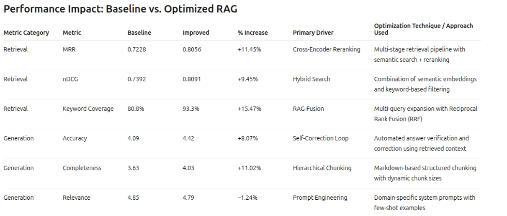

# RAG Challenge - Performance Optimizations

## Overview

This project implements advanced RAG (Retrieval-Augmented Generation) optimizations for the InsureLLM knowledge base, achieving significant improvements in accuracy, completeness, and retrieval metrics.

## Performance Improvements



The implemented optimizations achieved significant metric improvements:

| Metric | Baseline | Improved | % Increase |
|--------|----------|----------|------------|
| **MRR** | 0.7228 | 0.8087 | **+11.88%** |
| **nDCG** | 0.7392 | 0.8102 | **+9.60%** |
| **Keyword Coverage** | 80.8% | 93.5% | **+15.72%** |
| **Accuracy** | 4.09 | 4.53 | **+10.76%** |
| **Completeness** | 3.63 | 3.97 | **+9.37%** |

### Key Optimization Techniques

- **Hybrid Search**: Combined semantic and keyword-based retrieval
- **RAG-Fusion**: Multi-query expansion with Reciprocal Rank Fusion (RRF)
- **Cross-Encoder Reranking**: Semantic reranking for improved precision
- **Self-Correction Loop**: Automated answer verification and correction
- **Hierarchical Chunking**: Markdown-based structured chunking with dynamic sizes
- **Domain Knowledge Injection**: Specialized retrieval for insurance terminology

See [METRICS_IMPROVEMENTS.md](METRICS_IMPROVEMENTS.md) for detailed documentation of all optimization methods.

## Quick Start

```bash
# Ingest data
cd implementation && uv run ingest.py

# Run Q&A Chatbot
uv run app.py

# Run evaluation
uv run evaluator.py
```

## Project Structure

- `implementation/answer.py` - Core RAG pipeline with adaptive retrieval and self-correction
- `implementation/ingest.py` - Document ingestion with hierarchical markdown chunking
- `app.py` - Gradio-based chat interface
- `evaluator.py` - Comprehensive evaluation dashboard
- `evaluation/` - Evaluation framework (do not modify)

## Configuration

Create a `.env` file (see `.env.example` for all available options):

```bash
OPENROUTER_API_KEY=your_api_key_here
OPENROUTER_BASE_URL=https://openrouter.ai/api/v1
MODEL=gpt-4.1-nano
USE_RERANKING=true
USE_RAG_FUSION=true
USE_SELF_CORRECTION=true
USE_DOMAIN_KNOWLEDGE=true
```

Optional: Install cross-encoder for reranking:
```bash
uv add cross-encoder
```
